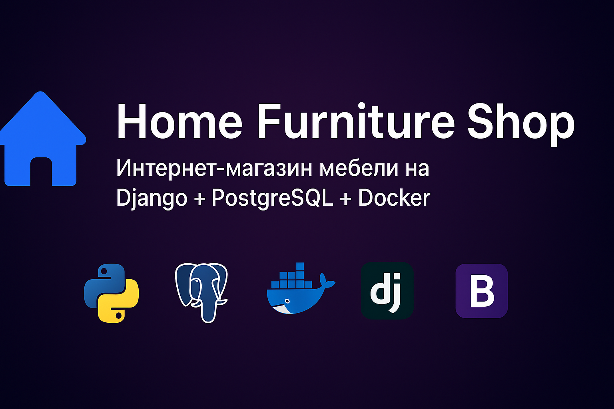
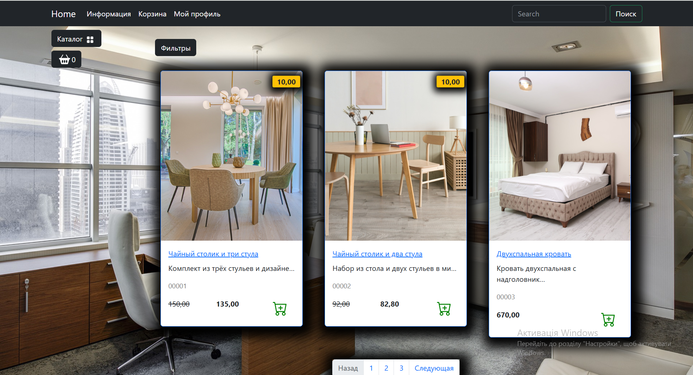
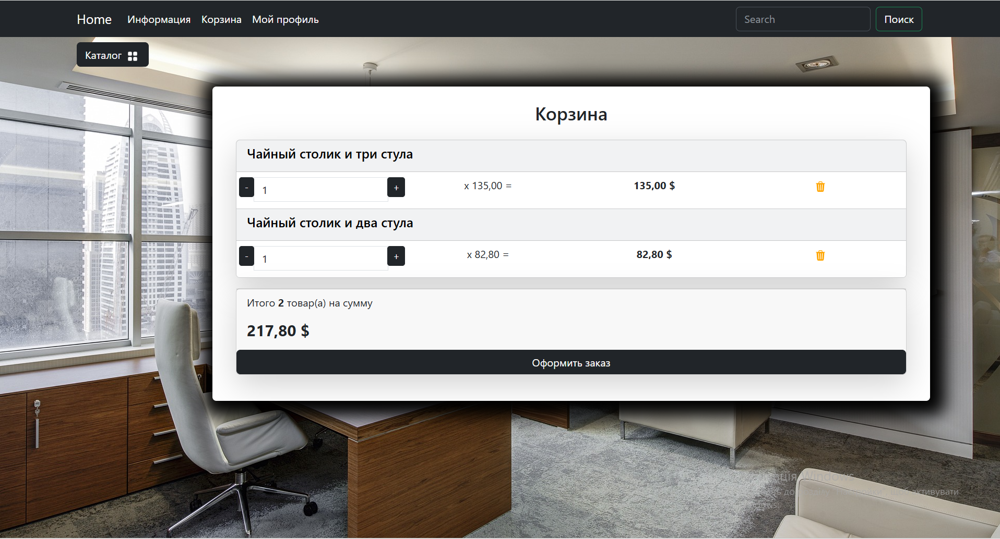
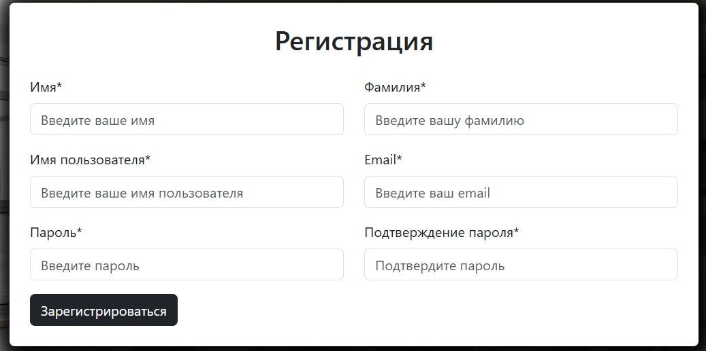
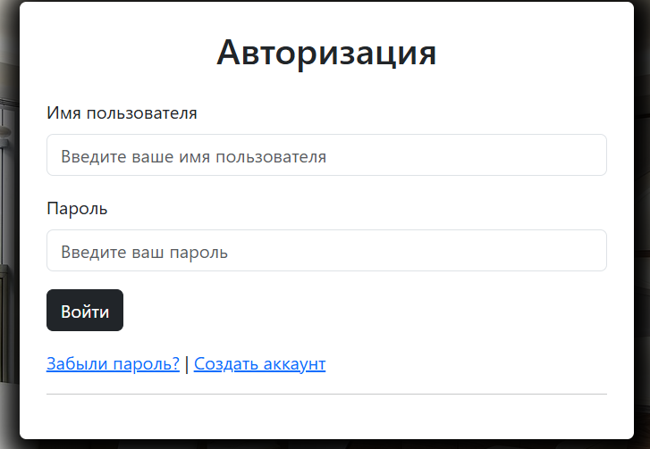
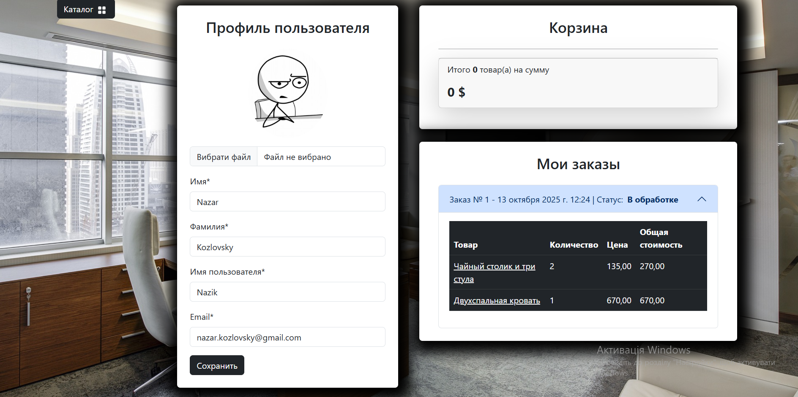
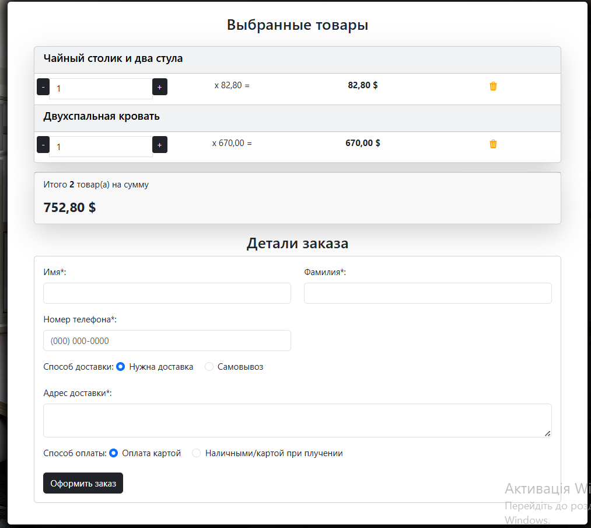

<p align="center">
  
</p>

<h1 align="center">🏠 Home Furniture Shop</h1>
<h3 align="center">Online Furniture Store built with Django + PostgreSQL + Docker</h3>

<p align="center">
  <b>Registration · Authentication · Product Catalog · Cart · Orders · Admin Panel</b><br>
  <b>Search · Sorting · Filters · Pagination · Caching</b>
</p>

---

**Home Furniture Shop** is a fully functional online furniture store built with **Django 4.2**, using **PostgreSQL** as the database and **Docker Compose** for containerization and deployment.
The project is fully ready for deployment on a production server.

---

## Technologies

* **Python 3.11+**
* **Django 4.2.23**
* **PostgreSQL 15**
* **Docker & Docker Compose**
* **Gunicorn**
* **Nginx**
* **Pillow**
* **python-decouple**
* **django-debug-toolbar**
* **Bootstrap 5** (used in templates)

---

---

## ⚙️ Installation and Launch with Docker

### 1️⃣ Clone the repository:

```bash
git clone https://github.com/Nazar-Goat/furniture-shop.git
cd furniture-shop
```

### 2️⃣ Create the `.env.prod` file in the project root:

```bash
DEBUG=False
SECRET_KEY=your_secret_key
ALLOWED_HOSTS=*
DB_NAME=furniture_db
DB_USER=furniture_user
DB_PASSWORD=furniture_password
DB_HOST=db
DB_PORT=5432
```

### 3️⃣ Build and start the containers:

```bash
docker-compose up -d --build
```

After building, the website will be available at:

```
http://localhost:8080
```

---

## 🗂 Project Applications

### **1. main**

* Home page of the shop
* Navigation by categories
* Display of popular products

📷 *Example:*

<p align="center">
  
</p>

---

### **2. goods**

* Full product catalog
* Search (`/catalog/search/`)
* Filter by category (`/catalog/<category_slug>/`)
* Sorting and filtering by discounts
* Product detail page (`/catalog/product/<slug>/`)

📷 *Example pages:*

<p align="center">
  
</p>

---

### **3. carts**

* Add and remove items from the cart
* Calculate total amount
* AJAX cart updates without page reload

📷 *Example cart page:*

<p align="center">
  
</p>

---

### **4. users**

* User registration and authentication
* Password recovery
* User profile and order history

📷 *Example authentication pages:*

<p align="center">
  
  
</p>

---

### **5. profile**

* Personal account
* Edit user information
* Cart overview
* Orders list

📷 *Example profile page:*

<p align="center">
  
</p>

---

### **6. orders**

* Order creation and checkout
* Data and cart validation
* Purchase confirmation


<p align="center">
  
</p>

---

## 🧠 Key Features

✅ User registration and login
✅ Catalog with categories and filters
✅ Discounts and dynamic product pricing
✅ Cart with total calculation
✅ Order checkout process
✅ Django Admin panel
✅ Query optimization and caching

---

Хочешь, чтобы я адаптировал этот README под стиль Upwork-портфолио (чуть короче и более презентабельно, с упором на стек и функциональность)?
